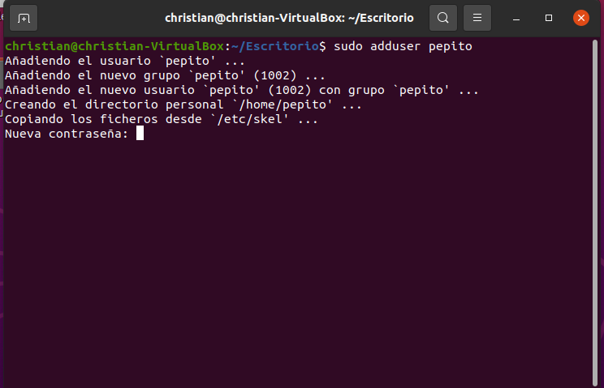
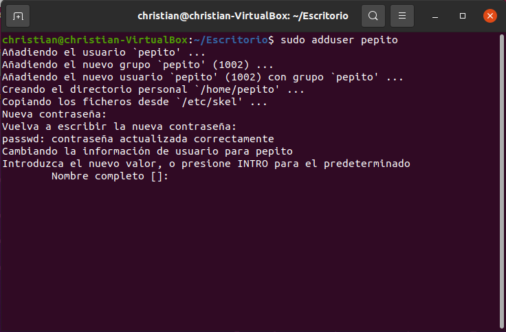
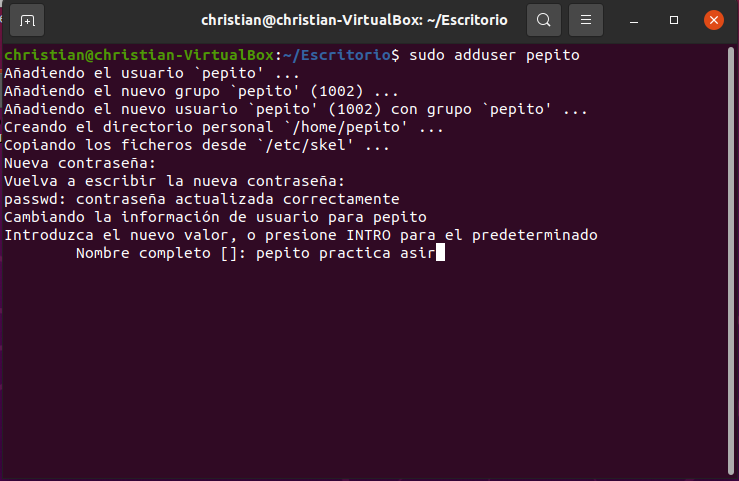
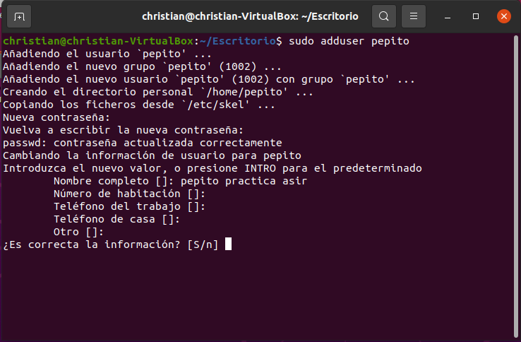
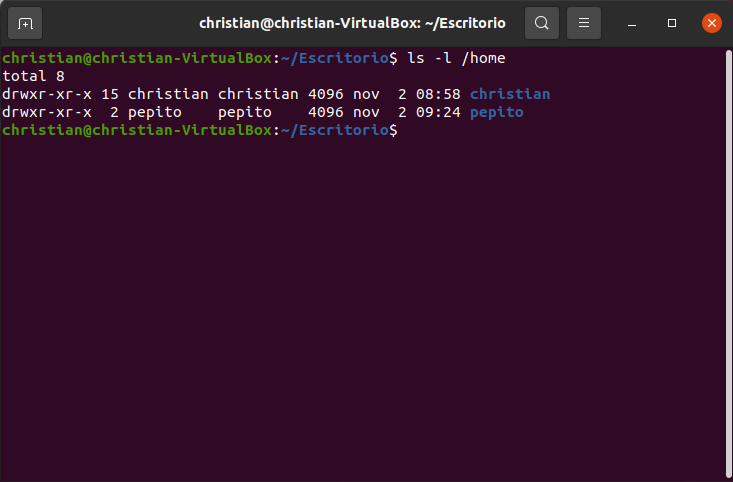
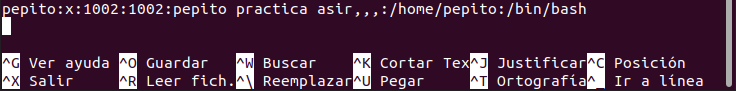
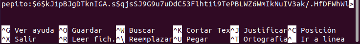

# Actividad 2: Usuarios, grupos, etc/passwd y etc/shadow

- [1. /etc/passwd](#1-etcpasswd)
- [2. /etc/shadow](#2-etcshadow)
- [3. Useradd](#3-useradd)
- [4. Aclaración de la contraseña del usuario](#4-aclaración-de-la-contraseña-del-usuario)
- [5. Creacción de un segundo usuario](#5-creacción-de-un-segundo-usuario)

## 1. /etc/passwd
~~~
etc/passwd
~~~

En este fichero podemos ver quien puede acceder al sistema y que puede hacer una vez estea dentro, solo es editable por usuarios root o usuarios con permisos sudo, pero todos los usuarios pueden leerlo.

UID: Es el identificador que tiene cada usuario

GID: Es el identificador que tiene un grupo, asi podremos identificar los usuarios por grupos. 

~~~
chsh -s
~~~
Es un comando que nos permite cambiar el Shell de inicio de sesión, los shells válidos se guardan en el archivo /etc/shells.

## 2. /etc/shadow
Este comando es un archivo de texto que contiene la información sobre las contraseñas de los usuarios del sistema.

La relación que tiene con el chsh - s es principalmente que cuando cambiamos el archivo que tenemos en /etc/shadows tambien cambia el Shell de inicio de sesión permitiendonos acceder al sistema.

## 3. Useradd
En este apartado usaremos el comando useradd, que nos permitira crear usuarios.Para ello usaremos los siguientes comandos:

~~~
sudo adduser <usuario que querramos crear>
~~~

> Ahora completaremos con la contraseña que querramos usar para este usuario.

> Ahora tendremos que añadir el nombre de usuario

> Nos pedira mas campos en los uales nos pedirá información para el usuario, en mi caso no la he completado ya que no me hacen falta, pero los siguientes campos serian los siguientes.

> Si toda la información añadida es correcta escribiremos "s" y le daremos a enter. Ahora comprobaremos si hemos creado el usuario.

~~~
ls -l /home
~~~

> Como podemos ver se ha creado el usuario con éxito

Ahora vamos a ver los permisos que tiene el usuario que hemos creado, para ello usaremos el siguiente comando.

~~~
sudo nano /etc/passwd
~~~

Y ahora veremos que tenemos una contraseña creada y esta encriptada, para verlo usaremos el comando:

~~~
sudo nano /etc/shadow
~~~

## 4. Aclaración de la contraseña del usuario
En este trabajo hemos creado la contraseña con el usuario directamente, pero en caso de que solamente se quiera añadir un usuario y porteriormente añadir una contraseña deberemos saber que cambiara el contenido de nuestro usuario en /etc/shadow.

## 5. Creacción de un segundo usuario

