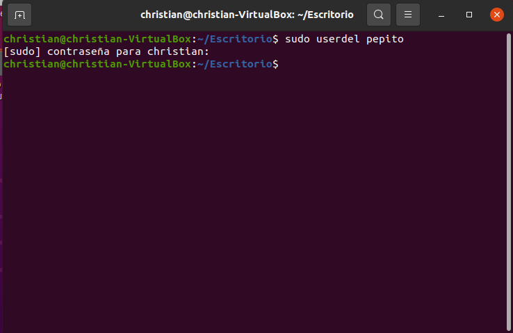

# Actividad 2: Usuarios, grupos, etc/passwd y etc/shadow

- [Actividad 2: Usuarios, grupos, etc/passwd y etc/shadow](#actividad-2-usuarios-grupos-etcpasswd-y-etcshadow)
  - [1. /etc/passwd](#1-etcpasswd)
  - [2. /etc/shadow](#2-etcshadow)
  - [3. Useradd](#3-useradd)
  - [4. Aclaración de la contraseña del usuario](#4-aclaración-de-la-contraseña-del-usuario)
  - [5. Creacción de un segundo usuario](#5-creacción-de-un-segundo-usuario)
  - [6. Eliminación del primer usuario](#6-eliminación-del-primer-usuario)
  - [7. Volver a crear el usuario del apartado 3 con adduser](#7-volver-a-crear-el-usuario-del-apartado-3-con-adduser)
  - [9. Explicacion del directorio /etc/skel](#9-explicacion-del-directorio-etcskel)
  - [10. Explicacion del fichero /etc/group](#10-explicacion-del-fichero-etcgroup)
  - [11. Creacion de 3 usuarios, grupos](#11-creacion-de-3-usuarios-grupos)
  - [12. Eliminar los usuarios pertenecientes a los grupos](#12-eliminar-los-usuarios-pertenecientes-a-los-grupos)
  - [13.Explicacion del comando chage](#13explicacion-del-comando-chage)
  - [14. Configuracion de permisos en la carpeta](#14-configuracion-de-permisos-en-la-carpeta)
  - [15. Creacion del cartafol proyects](#15-creacion-del-cartafol-proyects)
  - [16.Cambio de propietario](#16cambio-de-propietario)

## 1. /etc/passwd
~~~
etc/passwd
~~~

En este fichero podemos ver quien puede acceder al sistema y que puede hacer una vez estea dentro, solo es editable por usuarios root o usuarios con permisos sudo, pero todos los usuarios pueden leerlo.

UID: Es el identificador que tiene cada usuario

GID: Es el identificador que tiene un grupo, asi podremos identificar los usuarios por grupos. 

~~~
chsh -s
~~~
Es un comando que nos permite cambiar el Shell de inicio de sesión, los shells válidos se guardan en el archivo /etc/shells.

## 2. /etc/shadow
Este comando es un archivo de texto que contiene la información sobre las contraseñas de los usuarios del sistema.

La relación que tiene con el chsh - s es principalmente que cuando cambiamos el archivo que tenemos en /etc/shadows tambien cambia el Shell de inicio de sesión permitiendonos acceder al sistema.

## 3. Useradd
En este apartado usaremos el comando useradd, que nos permitira crear usuarios.Para ello usaremos los siguientes comandos:

~~~
sudo adduser <usuario que querramos crear>
~~~

> Ahora completaremos con la contraseña que querramos usar para este usuario.

> Ahora tendremos que añadir el nombre de usuario

> Nos pedira mas campos en los uales nos pedirá información para el usuario, en mi caso no la he completado ya que no me hacen falta, pero los siguientes campos serian los siguientes.

> Si toda la información añadida es correcta escribiremos "s" y le daremos a enter. Ahora comprobaremos si hemos creado el usuario.

~~~
ls -l /home
~~~

> Como podemos ver se ha creado el usuario con éxito

Ahora vamos a ver los permisos que tiene el usuario que hemos creado, para ello usaremos el siguiente comando.
Co comando adduser crea outro usuario. Mostra e explica:

    Unha captura do resultado de executar ls -l /home antes e despois de executar adduser.
    Unha captura da parte relevante de /etc/passwd tras a execución.
    Unha captura da parte relevante de /etc/shadow tras a execución.

## 4. Aclaración de la contraseña del usuario
En este trabajo hemos creado la contraseña con el usuario directamente, pero en caso de que solamente se quiera añadir un usuario y porteriormente añadir una contraseña deberemos saber que cambiara el contenido de nuestro usuario en /etc/shadow.

## 5. Creacción de un segundo usuario
En esta tarea crearemos otro usuario, este usuario se llamara "usuario2" para ello repetiremos el proceso del apartado 1

~~~
sudo adduser usuario2
~~~

> Ahora volveremos hacer un ls y veremos que nos aparecen los 2 usuarios creados anteriormente.

~~~
ls -l /home
~~~

> Ahora haremos lo mismo pero con /etc/passwd y nos aparecerán los permisos de ambos usuarios

~~~
sudo nano /etc/passwd
~~~

> Y ahora veremos el shadow de los usuarios creados anteriormente

~~~
sudo nano /etc/shadow
~~~

** Todas las capturas hechas en este apartado son despues de la creación del segundo usuario, para ver la comparación podemos ver las imagenes en el Apartado 3.

## 6. Eliminación del primer usuario 
En este apartado veremos como eliminar el usuario del apartado 3, para ello haremos lo siguiente:

~~~
sudo userdel -r pepito
~~~

> Ahora haremos el ls para ver los cambios

~~~
ls -l /home
~~~

> Lo siguiente será comprobar en /etc/passwd, para ello lo haremos como en los apartados anteriores.

~~~
sudo nano /etc/passwd
~~~

> Y ahora repetiremos el siguiente anterior paso pero con /etc/shadow

~~~
sudo nano /etc/shadow
~~~

Vemos que aunque hayamos eliminado el usuario se mantiene cierta información de este.

## 7. Volver a crear el usuario del apartado 3 con adduser
> En este apartado volveremos a crear el usuario que hemos eliminado con useradd.

~~~
sudo adduser pepito
~~~

~~~
sudo adduser pepito --shell /bin/bash
~~~

> Volvermos hacer un ls - l /home para ver los usuarios

> Volveremos a hacer el /etc/passwd

> Ahora haremos el /etc/shadow

## 9. Explicacion del directorio /etc/skel
Este directorio contiene ficheros y otros directorios que soon automaticamente copiados al home del usuario
Para verlo usaremos el comando siguiente:

~~~
sudo nano /etc/skel
~~~

## 10. Explicacion del fichero /etc/group
Este fichero sirve para definir los usuarios a los cuales pertenecen los usuarios

## 11. Creacion de 3 usuarios, grupos 
Hemos creado 3 usuarios los cuales hemos metido dentro de un grupo llamado directors.

## 12. Eliminar los usuarios pertenecientes a los grupos
Para eliminar los usuarios que pertenecen a los grupos haremos los siguientes comandos:

~~~
sudo gpasswd --delete jean-luc-godard directors
sudo gpasswd --delete andrei-tarkovsky directors
~~~

## 13.Explicacion del comando chage
Este comando se usa para configurar el tiempo de expedición de una contraseña y cuando debe de cambiarla. Si queremos cambiar la validez de esta usaremos el siguiente comando:

~~~
sudo chage -m 60 -M 60 juliet-berto
~~~

## 14. Configuracion de permisos en la carpeta
En este apartado simplemente tendremos que decir que permisos le queremos añadir o quitar a cada carpeta, en mi caso no lo voy a cambiar ya que estoy haciendo el trabajo desde esta maquina, el comando seria el siguiente.

~~~
sudo chmod [permisos] [documento o carpeta]
~~~

## 15. Creacion del cartafol proyects
para ello crearemos la carpeta con los permisos con el siguiente comando
~~~
sudo chmod 666 projects/
~~~
y comprobamos que nos aparezca

## 16.Cambio de propietario
Para cambiar el propietario de la carpeta usaremos el siguiente comando.

~~~
sudo chown -R juliet-berto projects/
~~~

