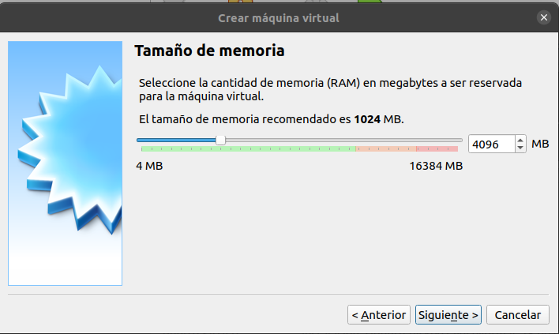
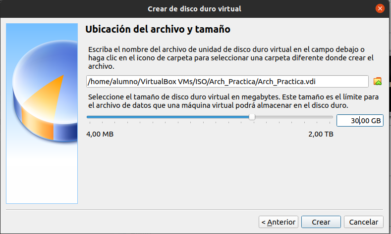
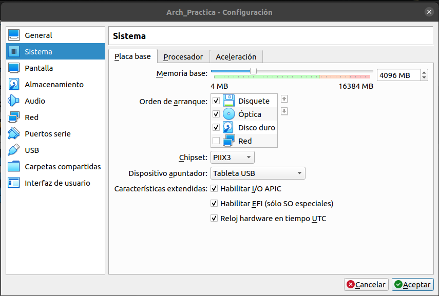
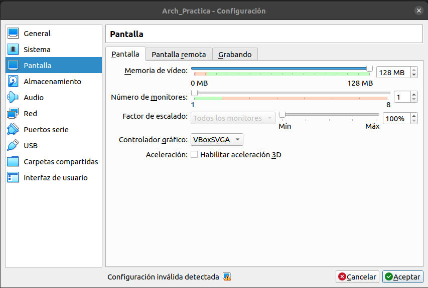
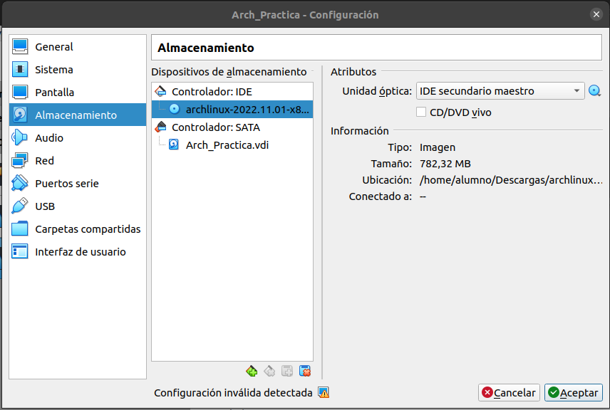
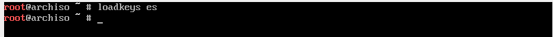
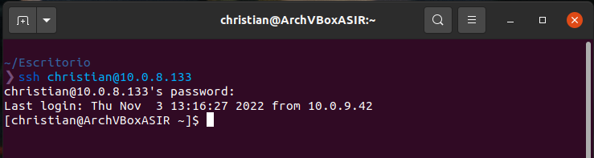
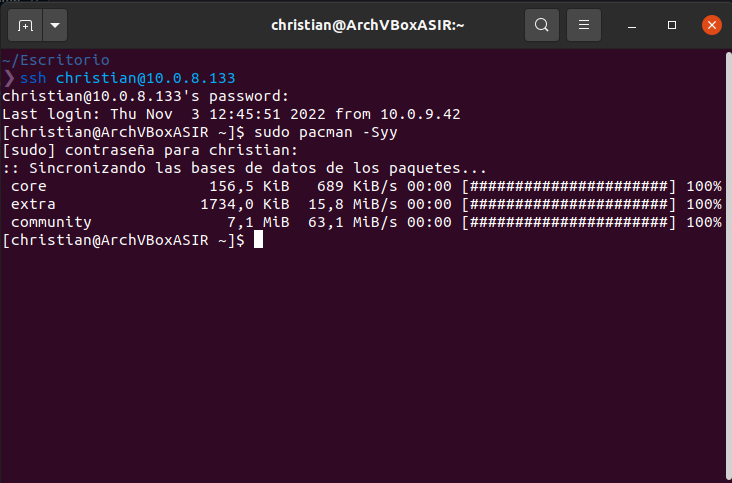
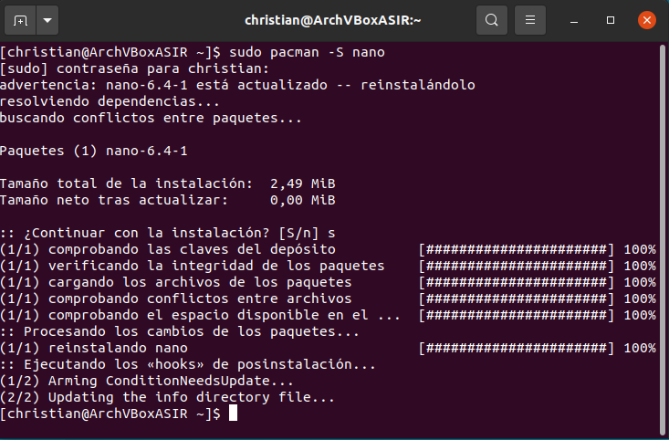

## 1. Configuración de la maquina virtual
### 1.1 Configuración de la RAM
Lo primero será configurar la máquina virtual, lo primero sera indicar cuanta memoria RAM vamos a utilizar, en mi caso serán 4096 MB

### 1.2 Configuración del disco virtual 
Ahora configuraremos cuanto almacenamiento queremos añadir para la máquina virtual, en mi caso serán 30 GB.

### 1.3 Otras configuraciónes de la máquina
Ahora realizaremos otras configuraciones de la máquina, para ello no dirigiremos a la configuración de la máquina y haremos lo siguiente:

- En el apartado de sistema habilitaremos lel apartado "Habilitar EFI"

- Ahora configuraremos la pantalla, para ello nos dirigiremos a pantalla y pondremos la memoria de video al máximo y en el controlador grafico usaremos VBoxSVGS.

- Lo siguiente será añadir la iso a la máquina, para ello nos dirigiremos a Almacenamiento y añadiremos la ISO.

## 2. Instalación de la máquina virtual
Lo primero será cammbiar la distribución de teclado para el español, para ello usaremos el siguiente comando.

~~~
loadkeys es
~~~

## Instalacion nano
Lo primero que tendremos que hacer será conectarnos por SH, para ello usaremos el siguiente comando

~~~
ssh [usuario]@[direccion ip de la maquina]
~~~

Luego ejecutaremos el siguiente comando:
~~~
 sudo pacman -Syy
~~~

Lo siguiente sera ejecutar el siguiente comando

~~~
 sudo pacman -S nano
~~~
 
