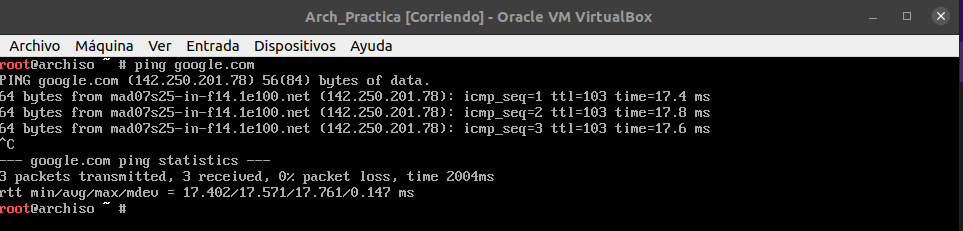
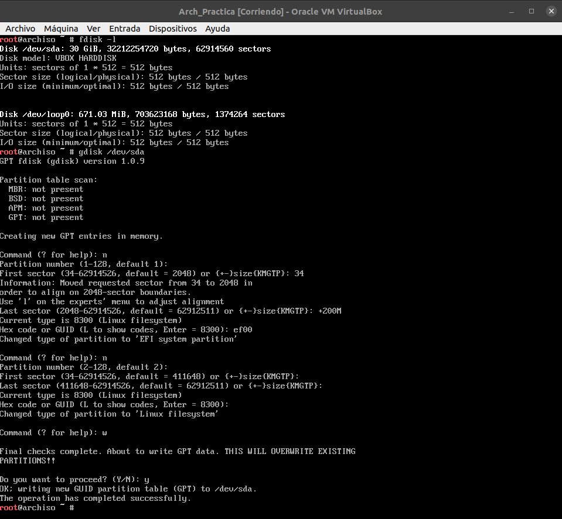
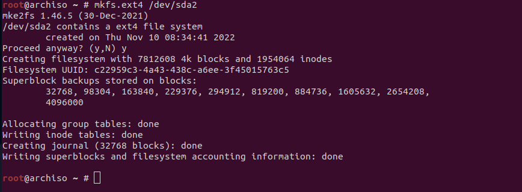
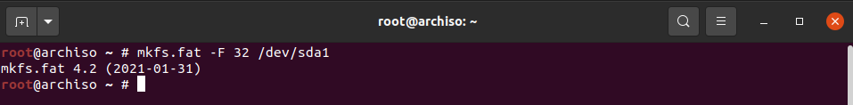
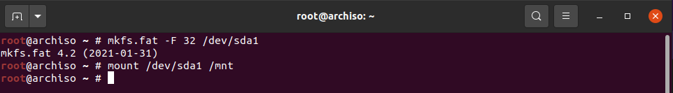
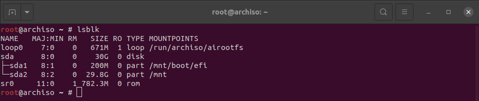
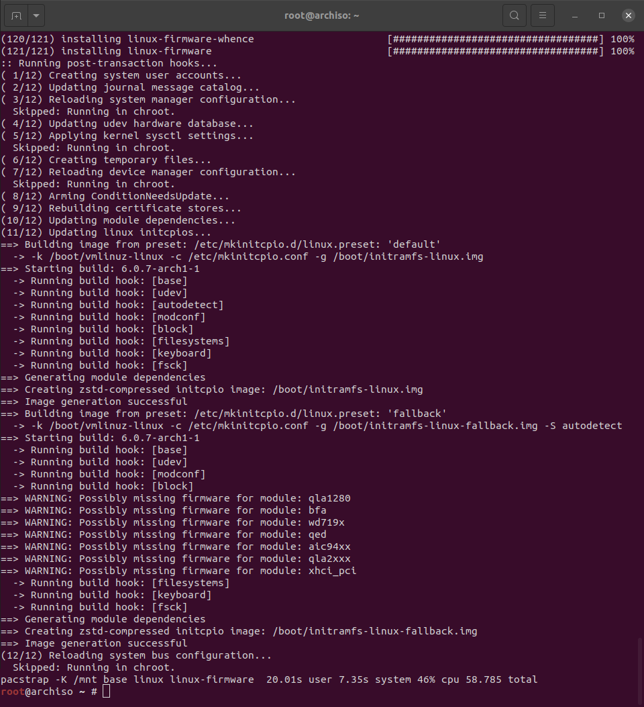
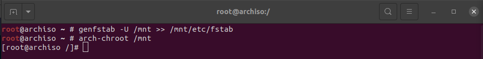

## 1. Definicion de conceptos

## 2. Configuración de la maquina virtual
### 2.1 Configuración de la RAM
Lo primero será configurar la máquina virtual, lo primero sera indicar cuanta memoria RAM vamos a utilizar, en mi caso serán 4096 MB

### 2.2 Configuración del disco virtual 
Ahora configuraremos cuanto almacenamiento queremos añadir para la máquina virtual, en mi caso serán 30 GB.

### 2.3 Otras configuraciónes de la máquina
Ahora realizaremos otras configuraciones de la máquina, para ello no dirigiremos a la configuración de la máquina y haremos lo siguiente:

- En el apartado de sistema habilitaremos lel apartado "Habilitar EFI"

- Ahora configuraremos la pantalla, para ello nos dirigiremos a pantalla y pondremos la memoria de video al máximo y en el controlador grafico usaremos VBoxSVGS.

- Lo siguiente será añadir la iso a la máquina, para ello nos dirigiremos a Almacenamiento y añadiremos la ISO.

## 3. Instalación de la máquina virtual
Lo primero será cammbiar la distribución de teclado para el español, para ello usaremos el siguiente comando.

~~~
loadkeys es
~~~

Ahora comprobaremos si tenemos conexión a Internet, para ello haremos un ping a google y comprobaremos si hay conexión

~~~
ping google.com
~~~

## 4. Configuración de los discos

Lo siguiente que tendremos que hacer será configurar el disco, para ello usaremos gdisk, con este comando podremos particionar el disco de la siguiente manera

~~~
gdisk /dev/sda
~~~

Una vez particionado el disco ahora le daremos formato, para ello usaremos los siguientes comandos:

~~~
mkfs.ext4 /dev/sda2
~~~

~~~
mkfs.fat -F 32 /dev/sda1
~~~

El siguiente paso será montar los discos, para ello usaremos los siguientes comandos

~~~
mount /dev/sda1 /mnt
~~~

~~~
mount --mkdir /dev/efi_system_partition /mnt/boot
~~~

Y comprobaremos que estea correctamente con el comando:

~~~
lsblk
~~~

## 5. Instalación del SO
Una vez hayamos montado y particionado los discos empezaremos con la instalación, para ello usaremos el siguiente comando.

~~~
pacstrap -K /mnt base linux linux-firmware
~~~

Ahora configuraremos el sistema con los siguientes comandos:

~~~
genfstab -U /mnt >> /mnt/etc/fstab
arch-chroot /mnt
~~~

Lo siguiente será configurarv la hora local con el siguiente comando

~~~
ln -sf /usr/share/zoneinfo/Spain /etc/localtime
hwclock --systohc
locale-gen
~~~

Ahora nos dirigiremos a /etc/locale.gen y decomentaremos el idioma que querramos usar, para España será el siguiente:

~~~
vim /etc/locale.gem
~~~

## Instalacion nano
Lo primero que tendremos que hacer será conectarnos por SH, para ello usaremos el siguiente comando

~~~
ssh [usuario]@[direccion ip de la maquina]
~~~

Luego ejecutaremos el siguiente comando:
~~~
 sudo pacman -Syy
~~~

Lo siguiente sera ejecutar el siguiente comando

~~~
 sudo pacman -S nano
~~~
 
