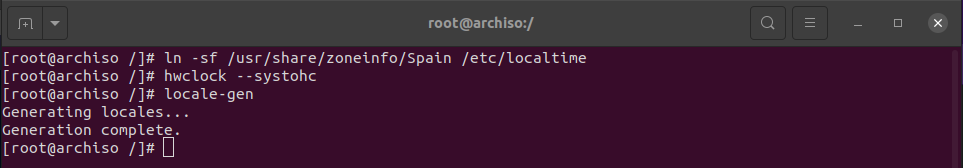
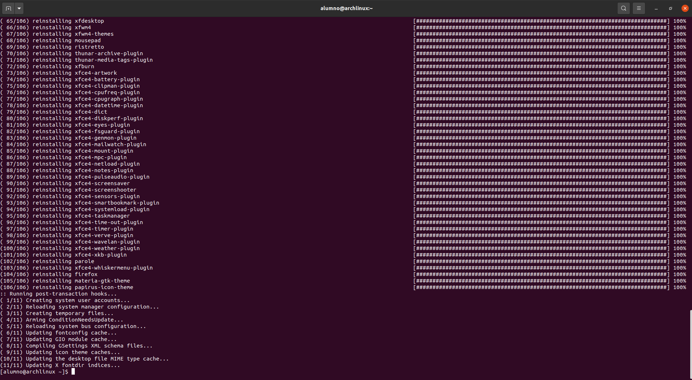

## 1. Definicion de conceptos

### ¿Que es la EFI,UEFI,BIOS,GPT,GUID Y MBR?

EFI: Significa Interfaz de firmware extensible y es un estándar diseñado para reemplazar el BIOS, el sistema de arranque que las computadoras han usado desde el principio. 

UEFI: Su función es la de iniciar los componentes de hardware y lanzar el sistema operativo de un ordenador cuando lo encendemos.

BIOS: Es el software integrado ala la placa base encargada de iniciar tu sistema y otras configuraciónes.

GPT: Es un estándar diseñado para realizar la configuración de las tablas de particiones y su ubicación en medios de almacenamiento como los discos duros.

GUID: Es un identificador que nos permite saber el numero del disco.

MBR: Es el sector de arranque, que esta ocupado por unos codigos que le dicen a la BIOS como actuar.

#
### Diferenciación entre la Iso y la partición

La diferencia es que si trabajamos en una Iso estamos cambiando configuraciones de la imagen de instalación para poder instalar el sistema, en cambio si trabajamos desde la instalación estamos configurando sobre un sistema operativo ya instalado.

#
### ¿Que es un reflector?

Es un script que puede recuperar la última lista de servidores de replicas desde la pagina "MirrorStatus".

### Explicar en Filesystem Table el flag: -U

Significa unmount, que se encarga de eliminar o desmontar los discos que tenemos en el equipo.

### Explicar los flags de timezone

CONV_TIMESTAMP: Convierte la fecha y la hora para su uso en otra zona horaria     

SYS_DATE: Devuelve la fecha actual al comienzo del procesamiento del script. 

SYS_DATE_PHYSICAL: Devuelve la fecha actual

SYS_TIME: Devuelve la hora actual del día al comienzo del procesamiento del script

SYS_TIME_PHYSICAL: Determina la hora actual del día 

SYS_TIMESTAMP_PHYSICAL: Proporciona la fecha y hora actual

### Explicacion de los paquetes: 

Grub: Es un cargador de arranque múltiple desarrollado por el proyecto GNU que nos permite elegir qué sistema operativo arrancar de entre los instalados. Se utiliza principalmente en el sistema operativo GNU/Linux.

Efibootmgr: Es una aplicación de espacio de usuario que modifica el administrador de arranque de la interfaz de firmware extensible (EFI) de Intel. Con esta aplicación, podemos crear y eliminar entradas de arranque, cambiar dicho orden de arranque, cambiar las siguientes opciones de ejecución de arranque, etc.

Networkmanager: Es una herramienta de software utilizada para simplificar el uso de redes informáticas en Linux y otros sistemas operativos basados ​​en Unix.

Network-manager-applet: Es el front-end de GNOME de NetworkManager. Muestra un icono en el área de notificación de GNOME. Funciona con otros entornos de escritorio que proporcionan una bandeja del sistema, como KDE o XFCE. Muestra una lista de redes disponibles y le permite cambiar fácilmente entre ellas. Para redes encriptadas, le pedirá una clave/contraseña, que puede guardar opcionalmente en la fuente de gnome para que no tenga que ingresarla nuevamente.

Dialog:_ Es un programa que te permite mostrar una serie de preguntas o mensajes en la pantalla usando cuadros de diálogo de shell. Dichos diálogos son adecuados para calendarios, listas de selección y otros tipos de diálogos.

Os-prober: Encargado de generar el archivo "/etc/grub.d/30_os-probe" a través del cual se determina el sistema operativo y utilizará grub para su menú de arranque.

Mtools: Es una colección de utilidades de dominio público que permiten a los sistemas Unix manipular archivos MS-DOS: leer, escribir y mover archivos en sistemas de archivos MS-DOS.

Dosfstools: Es una colección de herramientas de línea de comandos gratuitas y de código abierto que permiten a los usuarios crear, asignar y verificar fácil y rápidamente sistemas de archivos FAT de MS-DOS en sistemas operativos GNU/Linux.

Base-devel: Es un conjunto de paquetes que incluye las herramientas necesarias para construir (compilar y enlazar). No se requiere para una instalación básica y muchos usuarios no necesitan instalarlo. Puede instalarlo como parte de la instalación base o más adelante si lo encuentra útil.

Linux-headers: Se encarga de instalar una imagen linux como dependencia.

Cups: Es un sistema de impresión modular de código abierto que utiliza el Protocolo de impresión de Internet (IPP) como base para administrar impresoras, solicitudes de impresión y colas de impresión.

Reflector: Es un script que puede recuperar la última lista de servidores de replicas desde la pagina "MirrorStatus".

Openssh: Es un conjunto de aplicaciones que proporcionan comunicación encriptada a través de una red utilizando el protocolo SSH. Fue creado como una alternativa gratuita y abierta al programa propietario Secure Shell.

Git: El software de control de versiones fue desarrollado originalmente por Linus Torvalds y se ha convertido en una herramienta indispensable para el desarrollo de software, incluido el propio kernel de Linux.

Xdg-utils: Es un conjunto de herramientas que facilita la integración de aplicaciones en su entorno de escritorio, funciona con cualquier DE o WM, está disponible siempre que tenga una GUI.

Xdg-user-dirs: Es una herramienta que lo ayuda a administrar carpetas de usuarios que sean conocidas, como carpetas de escritorio y carpetas de música. También maneja la localización de nombres de archivos.

Virtualbox-guest-utils: Es un paquete de software que forma parte de VirtualBox que agrega funcionalidad a la instalación base de VirtualBox, mejorando su rendimiento y brindando un mejor nivel de integración huesped-host.

### Explicación de wheel, -m -G en users.

-m: Sirve para crear usuarios en /home/usuario, pero los uauarios que se creen con -m podrán leer, escribir y modificar aunque no sean superusuarios.

-G: Se encarga de introducir los usuarios a los grupos que querramos.

### Explicación Visudo
Visudo abre un editor de texto, pero conserva la sintaxis del archivo. Esto elimina la posibilidad de una configuracion incorrecta que impida las operaciones sudo, que pueden ser la única forma de obtener privilegios de superusuario.

## 2. Configuración de la maquina virtual
### 2.1 Configuración de la RAM
Lo primero será configurar la máquina virtual, lo primero sera indicar cuanta memoria RAM vamos a utilizar, en mi caso serán 4096 MB

### 2.2 Configuración del disco virtual 
Ahora configuraremos cuanto almacenamiento queremos añadir para la máquina virtual, en mi caso serán 30 GB.

### 2.3 Otras configuraciónes de la máquina
Ahora realizaremos otras configuraciones de la máquina, para ello no dirigiremos a la configuración de la máquina y haremos lo siguiente:

- En el apartado de sistema habilitaremos lel apartado "Habilitar EFI"

- Ahora configuraremos la pantalla, para ello nos dirigiremos a pantalla y pondremos la memoria de video al máximo y en el controlador grafico usaremos VBoxSVGS.

- Lo siguiente será añadir la iso a la máquina, para ello nos dirigiremos a Almacenamiento y añadiremos la ISO.

## 3. Instalación de la máquina virtual
Lo primero será cammbiar la distribución de teclado para el español, para ello usaremos el siguiente comando.

~~~
loadkeys es
~~~

Ahora comprobaremos si tenemos conexión a Internet, para ello haremos un ping a google y comprobaremos si hay conexión

~~~
ping google.com
~~~

## 4. Configuración de los discos

Lo siguiente que tendremos que hacer será configurar el disco, para ello usaremos gdisk, con este comando podremos particionar el disco de la siguiente manera

~~~
gdisk /dev/sda
~~~

Una vez particionado el disco ahora le daremos formato, para ello usaremos los siguientes comandos:

~~~
mkfs.ext4 /dev/sda2
~~~

~~~
mkfs.fat -F 32 /dev/sda1
~~~

El siguiente paso será montar los discos, para ello usaremos los siguientes comandos

~~~
mount /dev/sda1 /mnt
~~~

~~~
mount --mkdir /dev/efi_system_partition /mnt/boot
~~~

Y comprobaremos que estea correctamente con el comando:

~~~
lsblk
~~~

## 5. Instalación del SO
Una vez hayamos montado y particionado los discos empezaremos con la instalación, para ello usaremos el siguiente comando.

~~~
pacstrap -K /mnt base linux linux-firmware
~~~

Ahora configura## Instalación de paquetes KDE
Ahora vamos a instalar por paquetes kde, para ello usaremos los siguientes comandos.

~~~
pacman -S kf5 kf5-aids
~~~

~~~
pacman -S ttf-freefont
~~~

~~~
pacman -S sddm sddm-kcm
~~~

~~~
genfstab -U /mnt >> /mnt/etc/fstab
arch-chroot /mnt
~~~

Lo siguiente será configurarv la hora local con el siguiente comando

~~~
ln -sf /usr/share/zoneinfo/Spain /etc/localtime
hwclock --systohc
locale-gen
~~~

Ahora nos dirigiremos a /etc/locale.gen y decomentaremos el idioma que querramos usar, para el Español será el siguiente:

~~~
vim /etc/locale.gem
~~~

luego lo escribiremos en /etc/locale.conf y añadiremos lo siguiente:

~~~
vim /etc/locale.conf
~~~

Luego iremos a /etc/vconsole.conf y añadiremos lo siguiente:

Ahora vamos a hacer la instalación de paquetes, para ello usaremos el siguiente comando

~~~
pacman -S grub efibootmgr network-manager network-manager-applet dialog os-probe mtools dosfstools base-devel linux-headers cups reflector openssh xdg-utils xdg-user-dirs virturalbox-guest-utils
~~~

~~~
grub-install
grub-mkconfig -o /boot/grub/grub.cfg
~~~

~~~
systemctl enable NetworkManager
systemctl enable ssh
~~~

6. Creación de los usuarios
En este punto tendremos que crear un usuario y ponerle una contraseña, lo cual tenemos la explicación en la tarea 2 en la cuál nos dedicamos íntegramente a la creación y modificación de los usuarios en un sistema. Igualmente voy poner los comandos a continuación.

~~~
adduser alumno
passwd alumno
~~~

## 7. Instalación del entorno gráfico
Una vez hayamos reado el usuario que tenemos anteriormente, tendremos que instalar el entorno gráfico, para ello usaremos los siguientes comandos.

~~~
sudo pacman -S xf86-video-vmware xorg lightdm lightdm-gtk-greeter xfce4 xfce4-goodies firefox materia-gtk-theme papirus-icon-theme
~~~

~~~
sudo systemctl enable lightdm
~~~

Una vez hayamos hecho eso reiniciarenos el sistema y veremos que nos aparecerá el usuario que hemos creado y nos pedirá la contraseña, solo tendremos que introducirla y ya nos iniciara sesion.

## 8. Instalacion nano
Lo primero que tendremos que hacer será conectarnos por SH, para ello usaremos el siguiente comando

~~~
ssh [usuario]@[direccion ip de la maquina]
~~~

Luego ejecutaremos el siguiente comando:
~~~
 sudo pacman -Syy
~~~

Lo siguiente sera ejecutar el siguiente comando

~~~
 sudo pacman -S nano
~~~
 

