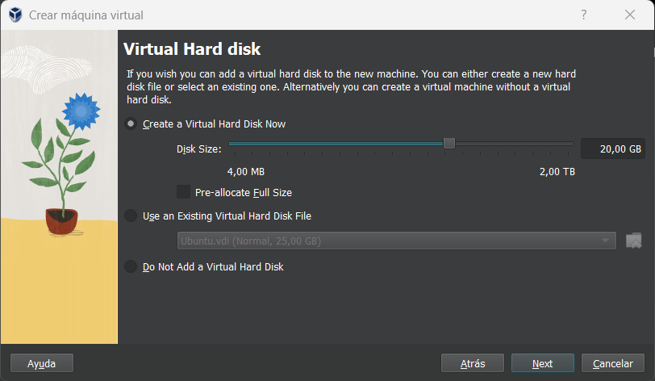

# Arch on VirtualBox
[Guía de la instalación](https://wiki.archlinux.org/title/installation_guide)

# Definiciones

- **Conceptos:**

**EFI:** Fue desarollada por Intel y es una capa entre el hardware y el Sistema Operativo, se usa en los equipos más actuales, es similar a la UEFI pero sin las mejoras que presenta esta última.

**UEFI:** A diferencia de la BIOS la UEFI tiene mejoras (mayor tamaño de memoria y un rendimiento mas rápido) y se encarga de iniciar el istema operativo cuando un equipo se está encendiendo, además proporciona interfaz grafica mientras el S.O se inicia.

**BIOS:** Es un software de sistema  que se encarga de iniciar y controlar el hardaware del equipo cuando se enciende, la BIOS se almacena en la ROM y se carga en la RAM, este a la vez carga el sistema. Es un sistema antiguo aunque todavía se sigue utilizando en nuevos equipos aunque la gran mayoria usa la UEFI.

**GPT:** Es una tabla de particiones que se utiliza en equios con S.O modernos, se utiliza para dividir el disco duro en particiónes (Son secciónes independientes del disco que pueden usarse para almacenar datos).

**GUID:** Es un número de identificación único de 128 bits asignados a los objetos del Sistema Operativo (Discos duros, particiones de disco, controladores de dispositivos, aplicaciónes....) El GUID se genera utilizando un algoritmo que garantiza que cada numero generado es único en todo el mundo.

**MBR:** Es una zona del disco duro que almacena información importante sobre como se dividen las particiones de un disco duro, la MBR se encarga de cargar el sistema operativo en la RAM cuando se enciende el equipo y proporciona una serie de funciónes básicas par el sistema, como la configuración del reloj del sistema y el control de la entrada y salida de datos.

- Diferenciar claramente cando nos atopamos na ISO de instalación e na partición(s) instalada(s).

Cuando nos encontramos en la ISO de instalación estamos trabajando directamente sobre el sistema de instalación, es decir, aun estamos configurando el sistema que **aun vamos a instalar**. En cambio cuando nos encontramos en una particion significa que el sistema ya se ha instalado y estamos configurando el sistema en un sistema operativo **ya instalado**

- Que é reflector?
Un reflector es un software (o dispositivo) que redirige paquetes de datos de una red a otra, se usan normalmente para ampliar la cobertura de una red inalámbrica o para crear una conexión segura a través de una VPN (Red Privada Virtual).

## 1. Create and Configure a Virtual Machine
Antes de nada  tendremos que descargar la Iso de archlinux, para ello podemos acceder al siguiente [enlace](https://archlinux.org/download/)
### 1.1 Creation
El primer paso que tendremos que hacer será crear la máquina virtual desde VirtualBox, a continuación mostraré paso a paso como crear la máquina de ArchLinux.

-Paso 1: En VirtualBox clikaremos en "Nuevo"y nos aparecerá la siguiente pestaña, el la cual tendremos que añadir un nombre a la máquina y añadiremos la ISO del sistema que querramos instalar, en este caso será la de un archlinux.

-Paso 2: El siguiente paso será poner cuanta RAM  queremos usar para nuestra máquina, en mi caso pondre 2 GB de Ram.

* **Nota**: En la parte de nucleos del procesador le he puesto 2 nucleos, ya que si se le deja en default coge 1 y no deja iniciar las máquinas.

-Paso 3: Una vez indicada la RAM tendremos que configurar el espacio de disco que queremos utilizar para la máquina Virtual, en mi caso le he puesto 20GB.

-Paso 4: Ahora nos aparecerá una pestaña donde nos resumira las configuraciónes que hemos hecho a la máquina, le daremos a terminar ya que un tenemos que configurar un par de opciones mas.

-Paso 5: Ahora nos dirigiremos a la configuración de la máquina (Clik derecho en la maquina y le daremos a "Configuraciones") en el partado de "Sistema" habilitamos la opción "Habilitar EFI" 

### 1.3 Plugging in Arch ISO

***Nota :** En la versión más reciente de VirtualBox ya nos obliga a añadir al crear una máquina la Iso que queremos utilizar, aun  que hay versiones mas antiguas que la ISO se añade posteriormente, luego de la creación, en este apartado explicaré como añadir la ISO, en caso de que tengamos una version de VirtualBox anterior.

**-Paso 1:** Tendremos que dirigirnos a la configuración de la máquina, para ello tendremos que darle clik derecho a la máquina e ir a "configuración", una vez ahí buscaremos el apartado de "Almacenamiento", nos debreia aparecer esta pestaña.

**-Paso 2:** 
Una vez estemos en la confihuración, nos ririgiremos al apartado que tiene una imagen de un Cd, clikamos y añadimos la ISO de la siguiente manera:

Una vez hecho esto aplicaremos los cambios y saldremos.

## 2. Start the VM
Ahora clikaremos dos veces en la máquina virtual que hemos creado y nos iniciará la máquina, cuando haya arrancado nos aparecerá lo siguiente:

## 3. Keyboard 
 En este apartado cargaremos el idioma del teclado ya que la distribucion por defecto es el inglés, para ello usaremos el siguente comando.

 ~~~
 loadkeys es
 ~~~

## 4. Configuración del reloj

En este paso vamos a sincronizar la hora del reloj de nuestro equipo con el servidor de sistema de reloj, para ello usaremos los siguientes comandos:

~~~
timedatectl set-ntp true
timedatectl status
~~~

## 5. Configuracion de `ssh` y `passwd de root`
Para poder hacer una instalacion a través de otro equipo deberemos tener el `ssh` configurado, para ello usaremos el siguiente comando:

~~~
systemctl start sshd
~~~

Ahora configuraremos la contraseña de `root`, para ello usaremos el siguiente comando:

~~~
passwd root
~~~

y nos dirijiremos al terminal de nuestra máquina real (en nuestro caso) y comprobaremos que se conecta por ssh

## 6. Instalación de `reflector`
-`Reflector:` Reflector es un script que puede recuperar la última lista de servidores de réplicas desde la página MirrorStatus, filtrar la mayoría de los servidores de réplicas actualizados, ordénarlos por velocidad y sobrescribir el archivo.

-`Syy:` El flag `-S` indica que queremos sincronizar paquetes e instalarlos; el flag `-yy` obliga a descargar paquetes actualizados aunque ya existan.

## 7. Particionado de los discos
**-Paso 1**: Comprobaremos las particiones de nuestro disco usando el siguiente comando:

~~~
gdisk /dev/sda
~~~

Y crearemos las particiones de la siguiente manera:

Lo siguinete que tendremos que hacer será dar formato a las particiones de la siguiente manra:

Y ahora creareos y montaremos los sistemas de ficheros con los siguientes comandos:

~~~
mkdir -p /mnt/boot
mkdir -p /mnt/etc
mount /dev/sda2 /mnt
mount /dev/sda1 /mnt/boot
~~~

## 5. Extra packages needed

Ahora vamos a instalar los paquetes que vamos a necesitar, en este caso serán: Base, Kernel y firmware, para ello tendremos que configurar lo instalaremos con el siguiente script:

~~~
pacstrap -K /mnt base linux linux-firmware
~~~

## 6. Generar fichero `fstab`

Ahora generaremos los ficheros fstab, para ello usaremos los siguientes comandos:

~~~
genfstab -U /mnt >> /mnt/etc/fstab
~~~

## 7. Timezone
Para ello usaremos los siguientes comandos:

~~~
ln -sf /usr/share/zoneinfo/Region/City /etc/localtime
hwclock --systohc
~~~

`-s:` Crea un link simbolico

`-f:` Elimina los directorios existentes y escribe los nuevos.

## 8. Generar Locales
Estos son los conjuntos de parámetros  que utilizan programas para renderizar textos, monedas, horas..., para generar `locale` escribiremos los siguientes comandos:

~~~
locale-gen
echo LANG=en_US.UFT-8 >> /etc/locale.conf
~~~

### 8.1 `Vsconsole.conf`
En este paso volveremos a cambiar la distribucion del teclado permanentemente con el siguiente comando:

~~~
echo KEYMAP=es >> /etc/vconsole.conf
~~~

## 9. Configuración de la red
Ahora añadiremos el fichero `hostname` el nombre de equipo, para ello usaremos este comando:

~~~
echo ArchLinuxAct3 >> /etc/hostname
~~~

## 10. `Mkinitcpio`
 `Mkinitcpio` es un script de `bash` que se usa para crear un esquema para cargar un sistema de archivos para root

A partir de aqui me salen errores y no he podido continuar

