# Actividad 4, cuotas de disco

- [Actividad 4, cuotas de disco](#actividad-4-cuotas-de-disco)
  - [1. Definicion](#1-definicion)
  - [2. Como saber si nuestro S.O tiene instalado los modulos kernel para el uso de las cuotas](#2-como-saber-si-nuestro-so-tiene-instalado-los-modulos-kernel-para-el-uso-de-las-cuotas)
    - [2.1 Explicación del comando `find`, y los flags:](#21-explicación-del-comando-find-y-los-flags)
    - [2.2 Como podemos utilizar el comando `find` para saber si nuestro SO tiene instalado los módulos de kernel que permiten el manejo de las cuotas?](#22-como-podemos-utilizar-el-comando-find-para-saber-si-nuestro-so-tiene-instalado-los-módulos-de-kernel-que-permiten-el-manejo-de-las-cuotas)
    - [2.3 Que paquete tendriamos que instalar si no tuviésemos esos módulos kernel instalados?](#23-que-paquete-tendriamos-que-instalar-si-no-tuviésemos-esos-módulos-kernel-instalados)
  - [3. Donde activar las cuotas de un usuario y grupo](#3-donde-activar-las-cuotas-de-un-usuario-y-grupo)
    - [3.1 Haz los cambios pertinentes a los ficheros adecuados](#31-haz-los-cambios-pertinentes-a-los-ficheros-adecuados)
    - [3.2 que hay que hacer con el disco afectado? (si fuese necesario)](#32-que-hay-que-hacer-con-el-disco-afectado-si-fuese-necesario)
    - [3.3 Comproba que las opciones de disco son correctas](#33-comproba-que-las-opciones-de-disco-son-correctas)
  - [4.Activación de las cuotas](#4activación-de-las-cuotas)
    - [4.1 Creación de ficheros necesarios](#41-creación-de-ficheros-necesarios)
    - [4.2 Verificación de la creación de los ficheros adecuados](#42-verificación-de-la-creación-de-los-ficheros-adecuados)
    - [4.3 Añadir los módulos de quota al kernel (si fuese necesario)](#43-añadir-los-módulos-de-quota-al-kernel-si-fuese-necesario)
    - [4.4 Activa el sistema de cuotas](#44-activa-el-sistema-de-cuotas)
  - [5. Cuotas de usuario y de grupo](#5-cuotas-de-usuario-y-de-grupo)
  - [6. Informes de cuotas](#6-informes-de-cuotas)
  - [Información](#información)

## 1. Definicion
Las cuotas de disco son límites que son creados por el administrador de sistemaque limita el uso del sistema de archivos en los sistemas operativos. El paquete para manejar cuaotas es "quota quotatool"

## 2. Como saber si nuestro S.O tiene instalado los modulos kernel para el uso de las cuotas

### 2.1 Explicación del comando `find`, y los flags:
Es un comando que sirve para buscar archivos en el gestor de gestión de archivos a través de los parametros que le pongamos, por ejemplo, los siguientes

`-type`: Filtra por el tipo de archivo

`-name`: Filtra por el nombre

### 2.2 Como podemos utilizar el comando `find` para saber si nuestro SO tiene instalado los módulos de kernel que permiten el manejo de las cuotas?

Si queremos saber si nuestro equipo tiene instalado los modulos de kernel de cuotas usaremos el siguiente comando:

~~~
find /lib/modules/`uname -r` -type f -name '*quota_v*.ko*'
~~~

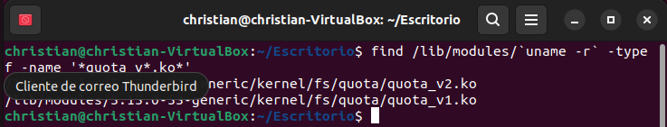

### 2.3 Que paquete tendriamos que instalar si no tuviésemos esos módulos kernel instalados?

Tendríamos que user el siguiente comando:

~~~
sudo apt install quota
~~~

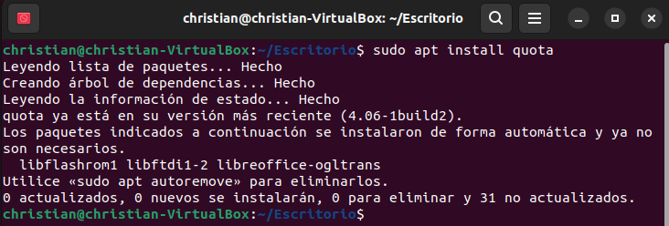

## 3. Donde activar las cuotas de un usuario y grupo

### 3.1 Haz los cambios pertinentes a los ficheros adecuados

Ahora nos dirijiremos a `/etc/fstab` y editaremos los datos de manera que quede como tenemos en la siguiente imagen:

** Nuestro UUID en esta maquina es 126970b1-346a-475a-af3e-d2cbbb27d3ee

~~~
sudo nano /etc/fstab
~~~
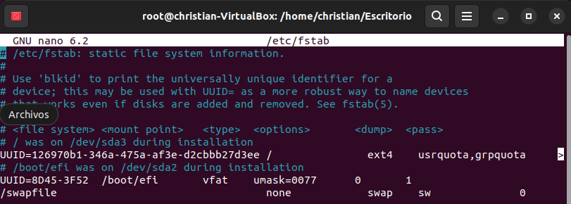

### 3.2 que hay que hacer con el disco afectado? (si fuese necesario)

Ahora tendremos que montarel sistema para aplicar los cambios, para ello usaremos el siguiente comando.

~~~
sudo mount -o remount /
~~~

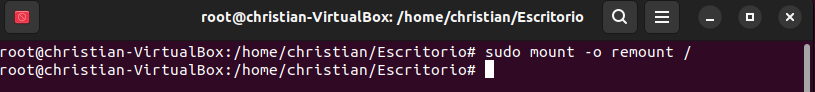

### 3.3 Comproba que las opciones de disco son correctas

Para comprobar que los comandos anteriores han funcionado usaremos los siguientes comandos.

~~~
cat /proc/mounts | grep ' / '
~~~

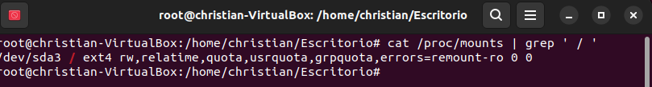

## 4.Activación de las cuotas

### 4.1 Creación de ficheros necesarios

-u: especifica que se creará un archivo de cuota basado en el usuario.

-g: especifica que se creará un archivo de cuota basado en grupos. 

-m: detiene el montaje del sistema de archivos como de solo lectura, al tiempo que brinda resultados precisos en entornos donde los usuarios aún guardan archivos. La opción m no es necesaria durante la instalación.

Ahora habilitaremos las cuotas, para ello usaremos los siguientes comandos:

~~~
quotacheck -cum /
quotacheck -cgm /
quotacheck -cugm /
~~~

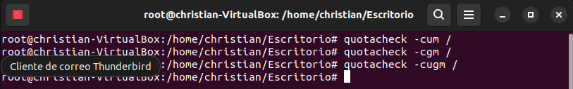

### 4.2 Verificación de la creación de los ficheros adecuados
Ahora vamos a verificar que tengamos los ficheros creados, para ello haremos un `ls /`

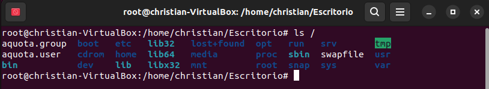

### 4.3 Añadir los módulos de quota al kernel (si fuese necesario)
El comando es el siguiente.

~~~
sudo apt install linux-image-extra-virtual
~~~

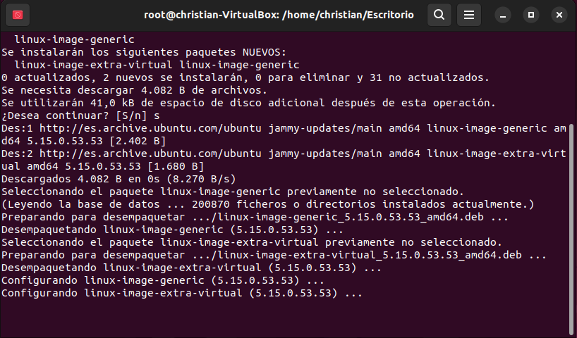

### 4.4 Activa el sistema de cuotas
Ahora vamos a activar las cuotas en root, para ello vamos usar los siguientes comandos:

~~~
sudo quotaon -v /
~~~

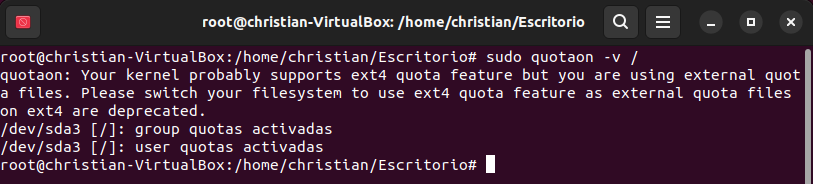

## 5. Cuotas de usuario y de grupo
Cada vez que establezas unha cuota comproba cun comando que a estableciches correctamente.

- Creade as usuarias `veronica-lake`, `gene-tierney`, `ada-lovelace` e `hedy-lamarr`.

Para ello usaremos los siguientes comandos:
~~~
sudo adduser (nombre del usuario)
~~~

- Creade os grupos de usuarias `actresses` e `scientists`.
 Para ello usaremos el comando 

~~~
sudo addgroup (Y aqui el nombre del grupo)
~~~
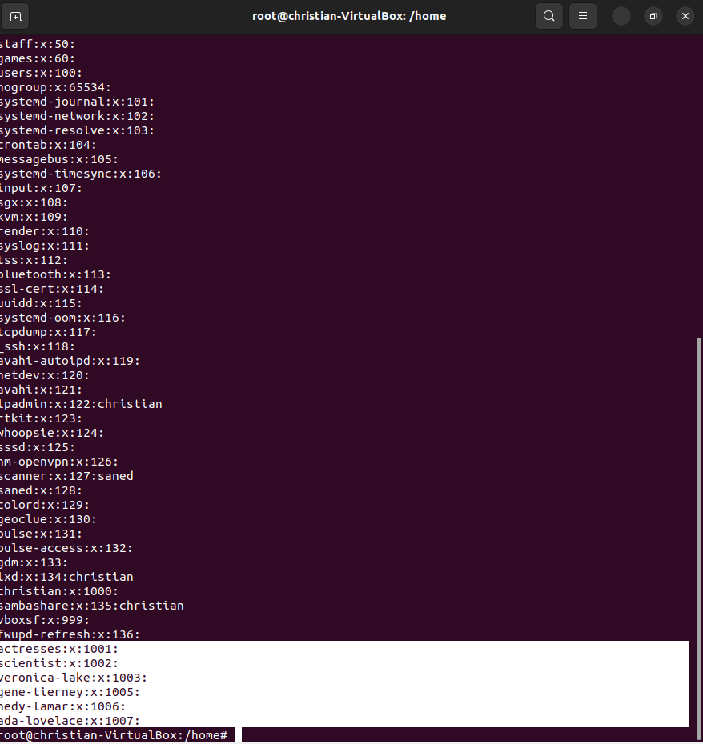

- Incluide a `veronica-lake`, `gene-tierney` e `hedy-lamarr` no grupo `actresses`

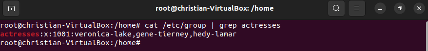

- Incluide a `ada-lovelace` e `hedy-lamarr` no grupo `scientists`.

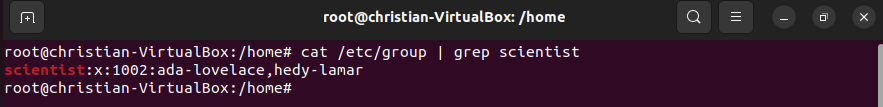

- Establece as seguintes cuotas de usuario:
  
Para la creadión de cuotas para los usuarios usaremos el siguiente comando:

~~~
edquota -u (y el nombre de usuarios)
~~~

   - `veronica-lake` 100M soft e 150M hard.

   - `gene-tierney` 200M soft e 250M hard.

   - `ada-lovelace` 500M soft e 600M hard.

   - `hedy-lamarr` 800M soft e 1G hard.

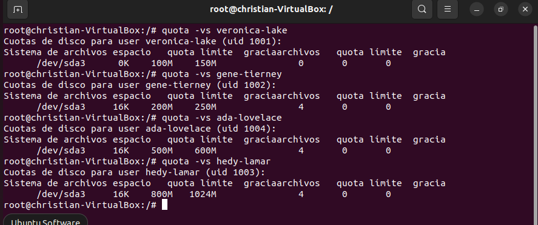

- Establecede as seguintes cuotas de grupo:

Para la creadión de cuotas de los grupos usaremos el siguiente comando:

~~~
edquota -g (y el nombre del grupo)
~~~

   - `actresses` 400M soft e 450M hard
   - `scientist` 900M soft e 1G hard

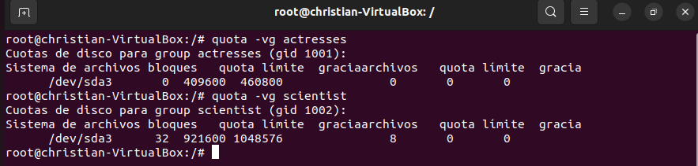

Comprobade os efectos que ten o solapamento das cuotas entre grupos e usuarias e explicádeos:

Para comprobarlo usaremos el comando:

~~~
quota -vg (nombre del grupo) (El parametro g es solamente para grupos)
quota -vu (nombre del usuario) (Es solamente para los usuarios)
~~~

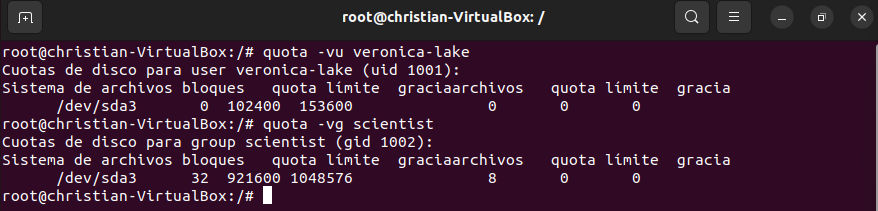

1. Cómo funcionan as cuotas nun grupo?

¿Qué son las cuotas en Linux?

Las cuotas le permiten limitar el uso del espacio del sistema de archivos por parte de los administradores del sistema. los mas comunes son los inodos: limitan el número de archivos, pero tabien hay los bloques que limitan por bloques.

2. Cómo afectan aos usuarios do grupo?

En caso de que tengamos un usuario con una cantidad limitada de cuota y estea en un grupo el cual (por ejemplo tiene 200M) se le aumenta es espacio a la cantidad de la cuota del usuario mas los 200M que recibe del grupo

3. Posibilidades:
   - A cuota do grupo afecta aos membros do grupo (sumadas)

Las cuotas del usuario son sumanas a las cuotas del grupo

   - A cuota do grupo afecta a cada membro do grupo (individualmente)
  
Las cuotas del grupo limitan el espacio de cada usuario aunque tenga una cuota diferente a la del grupo, siempre prevalecerá la del grupo.

## 6. Informes de cuotas
Jenera un informe global de las cuotas creadas
Para ello usaremos usaremos el siguiente comando:

~~~
repquota -vug /
~~~

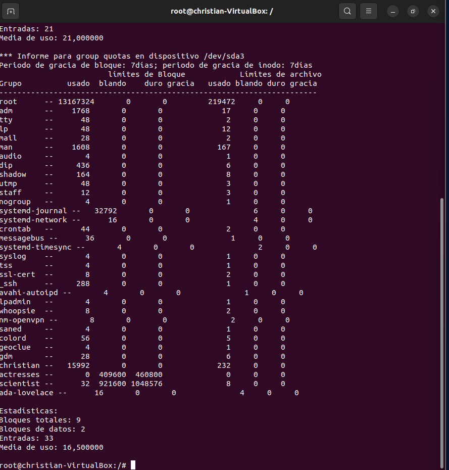

## Información
En este apartado voy a añadir las diferentes fuentes que he usado para realizar la tearea.

-Quotas

> https://www.linuxtotal.com.mx/index.php?cont=info_admon_018

> https://www.garron.me/es/gnu-linux/agregar-usuario-grupo-linux.html

> http://apuntes.ucr.ac.cr/index.php/Crear_cuotas_de_espacio_para_usuarios_y_grupos

-Otra información (guía) necesaria para el trabajo

> https://www.solvetic.com/tutoriales/article/8839-instalar-quota-y-crear-cuotas-de-disco-ubuntu-20-04-o-20-10/

- Video de la configuracion de las cuotas (el cual me sirvió una parte)
 >https://www.youtube.com/watch?v=Klg-eHxIDb4