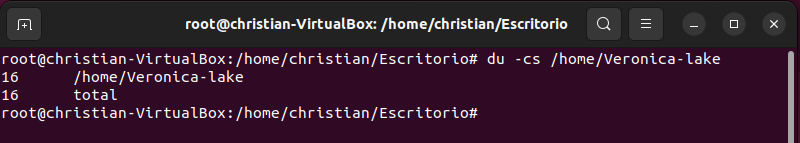
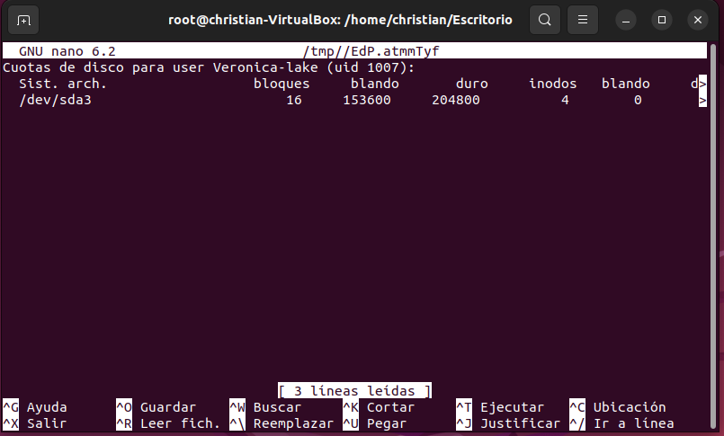

# Actividade 4: cuotas de disco

## 1 Cal é o páquete que permite manexar cuotas
El paquete que nos permite establecer y controlar las cuotas del disco de llama "quota".

## 2 Cómo saber se o noso sistema ten instalados os módulos do kernel que permiten o manexo de cuotas

Axuda:

1. Explica o comando `find`, e os flags:
   - `find`: Sirve parq buscar archivos y directorios por nombre, tamaño, tipo, propietario, fecha... 
   - `-type`: Se usa para buscar archivos   y directorios que coinciden con un criterio determinado.
   - `-name`: Sirve para buscar un archivo o un directorio que coinciden con un nombre determinando. 
2. Cómo podemos utilizar o comando `find` para saber se o noso sistema ten instalados os módulos do kernel que permiten o manexo de cuotas?

Podriamos saberlo usando el anterior comando de la siguiente manera:

~~~
find /lib/modules/$(uname -r) -name "*quota*.ko
~~~

3. Qué paquete teriamos que instalar se non tivésemos eses módulos kernel instalados?

En caso de que no tengamos instalado el módulo kernel tendremos que instalarlo con el siguiente comando:

~~~
sudo apt-get install quota
~~~

Si queremos comprobar la versión del paquete `quota` usaremos el siguiente comando:

~~~
quota --version
~~~

## 3 Onde debemos activar/declarar as cuotas de usuario e grupo

El primer paso para la activación de la cuotas será diirijirnos a `/etc/fstab` y editaremos el fichero con mucho cuidado ya que en caso de que eliminemos algo podemos eliminar el sistema **(como recomendación: si es la primera vez que se dita esto crear una instantánea de la máquina para evitar perder todo el sistema)** , para ello usaremos el siguiente comando:

~~~
nano /etc/fstab
~~~

Ahora montaremos el disco

~~~
sudo mount -o remount /
~~~

Para comprobar que lo hemos hecho bien usaremos el siguiente comando

~~~
cat /proc/mounts | grep /dev/sda
~~~

## 4 Activado as cuotas (tanto de usuario coma de grupo)

**Explicaciónes:**

`-u:` Indica que se deben mostrar los límites de cuota del usuario.

`-g:` indica que se deben mostrar los límites de cuota para el/los grupo
(s) afectados. 

`-m:` Sirve para alertar de que un usuario o grupo se esta acercando al límite de la cuota y se le notificará por correo electrónico.

`-c:` Indica los cambios que se han realizado a los límites de cuota de disco; sirve para apreciar todos los cambios hacia usuarios y grupos.

Crearemos los ficheros que necesitamos para usar `quota`, para ello usaremos el siguiente comando:

~~~
sudo quotacheck -cugm /
~~~

Verificaremos los ficheros, para ello lanzaremos el comando siguiente:

~~~
ls /
~~~

Ahora añadiremos los módulos kernel, para ello usaremos el siguiente comando:

~~~
sudo apt install linux-image-extra-virtual
~~~

El siguiente paso será activar las cuotas, para ello pondremos este comando:

~~~
sudo quotaon -v /
~~~

`-v`: Define mas información

## 5 Cuotas de usuario e de grupo

**NOTA**: ⚠️☣️☢️ non usar `setquota` ☢️☣️⚠️

Cada vez que establezas unha cuota comproba cun comando que a estableciches correctamente.

- Creade as usuarias `veronica-lake`, `gene-tierney`, `ada-lovelace` e `hedy-lamarr`.

~~~
sudo useradd <nombre del usuario>
~~~

- Creade os grupos de usuarias `actresses` e `scientists`.

~~~
sudo addgroup <nombre del grupo>
~~~

- Incluide a `veronica-lake`, `gene-tierney` e `hedy-lamarr` no grupo `actresses`

~~~
sudo usermod -a -G <grupos> <usuario>
~~~

- Incluide a `ada-lovelace` e `hedy-lamarr` no grupo `scientists`.

***Nota**: El comando es igual que para añadir usuarios colo que cambiando el grupo.

Confirmaremos que lo hayamos hecho bien con el siguiente comando:

~~~
cat /etc/group | grep scientists
~~~

- Establece as seguintes cuotas de usuario:

Para añadir las cuotas a los usuarios o grupos usaremos el siguiente comando:

~~~
edquota -u (y el nombre de usuario)
~~~

`u`: Es para indicar que son usuarios

`g`: Es para indicar que es para los grupos

   - `veronica-lake` 100M soft e 150M hard.
   - `gene-tierney` 200M soft e 250M hard.
   - `ada-lovelace` 500M soft e 600M hard.
   - `hedy-lamarr` 800M soft e 1G hard.

- Establecede as seguintes cuotas de grupo:
   - `actresses` 400M soft e 450M hard
   - `scientist` 900M soft e 1G hard

Comprobade os efectos que ten o solapamento das cuotas entre grupos e usuarias e explicádeos:

1. Cómo funcionan as cuotas nun grupo?
- Se limita el uso del disco al espacio maximo en el que estea configurado para un grupo en específico.

2. Cómo afectan aos usuarios do grupo?
-Todos los usuarios que estean dentro de un grupo tendrán el límite de la cuota del grupo.

3. Posibilidades:
   - A cuota do grupo afecta aos membros do grupo (sumada)
   Una cuota sumada es la cantidad total de cuotas que se han establecido para un período de tiempo determinado, se usa para regular el espacio u otros servicios.

- Para probar este apartado usaré el siguiente comando con el usuario veronica-lake:

`-c`: imprime el total al final de la salida

`-s`: imprime el total de la suma de tamaños

~~~
du -cs <directorio>
~~~

***Nota**: En este caso no nos aparece el espacio utilizado ya que no se ha usado el usuario pero en caso de haberse usado con este comando nos apareceria la suma de espacio que esta usando.

   - A cuota do grupo afecta a cada membro do grupo (individualmente)
   Los usuarios que pertenezcan a un grupo tendrán que cumplir una cuota individual de cada usuario, y este debe estar dentro de la cuota del grupo al que pertenece.

-Para esta prueba vamos a crear cuotas indidualmente, para ello usaremos:

~~~
edquota -u <usuario>
~~~

y dentro ajustaremos el tamaño a lo que nos interese pero deberá ser menos al límite que tiene el grupo.

***Nota** : En este caso ya tenemos un espacio configurado de un apartado anterior, pero podriamos cambiarlo a cualquier tamaño mientras sea menor que el límite del grupo.

## 6 Informes de cuotas

Para generar un informe de las quotas creadas usaremos el siguiente comando:

~~~
sudo repquota -vug /
~~~

## Información
Toda la información ha sido buscada página a página (páginas web, foros, videos de youtube).
